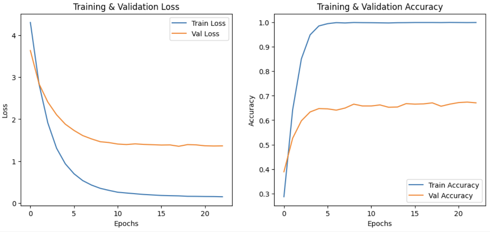
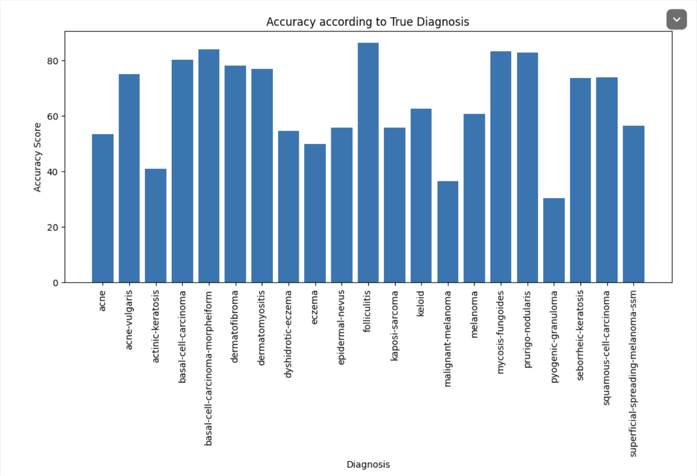
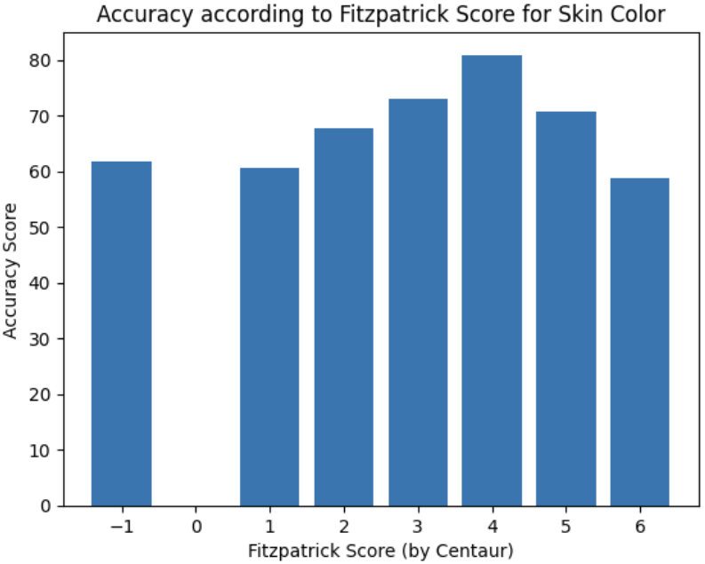
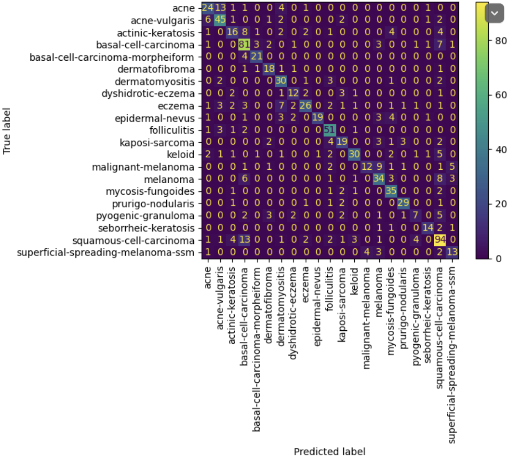

# Equitable AI for Dermatology

---

### **👥 Team Members**

| Name           | GitHub Handle  | Contribution                                                                                                                                                   |
| -------------- | -------------- | -------------------------------------------------------------------------------------------------------------------------------------------------------------- |
| Kiran Mitra    | @kiranmitra    | Researched base models, Tested Xception model, Proposed data preprocessing methods including double-axis data augmentation                                     |
| Nicole Sanchez | @N-Sanchez8661 | Contributed to EDA techniques, visualized dataset distributions, Tested ResNet50 Model                                                                         |
| Shivani Elitem | @ShivaniElitem | Visualized dataset distributions, Determined and removed empty images, Tested InceptionV3 Model,                                                               |
| Saba Sohail    | @saba-sohail   | Contributed to EDA techniques, experimented with custom focal loss, tested VGG16 Model                                                                         |
| Lucy King      | @lucyking140   | Built out initial transfer learning model from provided Colabs, set up data augmentation for skin color and diagnosis, experimented with new model structures. |

---

## **🎯 Project Highlights**

- Developed a deep learning model using transfer learning techniques to classify 21 different skin conditions across diverse skin tones.
- Achieved an F1 score of **0.57514**
- Ranked **18th out of 75+ teams** on the final Kaggle Leaderboard
- Implemented data augmentation strategies to improve model generalization, including adjustments for underrepresented skin tones.

🔗 [Equitable AI for Dermatology | Kaggle Competition Page](https://www.kaggle.com/competitions/bttai-ajl-2025/overview)

---

## **👩🏽‍💻 Setup & Execution**

**Provide step-by-step instructions so someone else can run your code and reproduce your results. Depending on your setup, include:**

- Download the notebook and other files (including data) as is
- Upload to Google Colab
- Hit Run All! Use a GPU accelerator to significantly increase runtime to around 20 minutes.

---

## **🏗️ Project Overview**

- Competition Context: Part of the Break Through Tech AI Program in collaboration with the Algorithmic Justice League (AJL).
- Objective: Build a fair and inclusive machine learning model for dermatology that accurately classifies skin conditions across diverse skin tones.
- Significance: Dermatology AI models often perform poorly on darker skin tones due to biased training data. This leads to diagnostic disparities and worsens health inequities.

---

## **📊 Data Exploration**

We used the data provided by the AJL Kaggle competition. We assumed and verified two class impbalances in the data: 1) by skin tone and 2) by diagnosis. We found out that skin colors are identified by two possible features: (fitzpatrick) centaur and (fitzpatrick) scale. We also checked for correlation between skin tones and certain diagnoses, but found none in the data.

- 
- 
- 
- 
- 
- 

**Image Filtering for Data Cleaning:**

- Implemented a filtering process to remove the dataset's empty or nearly empty images.
- Converted images to grayscale and analyzed their pixel intensity.
- Classified images with less than 40% pixel intensity as empty and removed them.
- Ensured only meaningful images were included to improve model performance.
- Verified file paths and updated the dataset to contain only valid images.

---

## **🧠 Model Development**

- Model(s) used:
  - CNNs with transfer learning
  - Experimented with the following base models: via keras
    - Xception (chosen)
    - Inception
    - ResNet
    - VGGNets (19 and 16)
- Feature selection and Hyperparameter tuning strategies
  - Training via epochs
  - Implemented dropout layers for regularization
  - Early stopping is used to prevent overfitting
- Training setup (e.g., % of data for training/validation, evaluation metric, baseline performance)
  - 80% training, 20% validation
  - Sparse categorical crossentropy and (custom) focal loss functions
  - Early stopping when validation loss has stopped improving
  - Reducing learning rate when validation loss has stopped improving

---

## **📈 Results & Key Findings**

- Placed 18th overall in the Kaggle leaderboard
- Final F1 score of 0.57514 on test dataset
- We struggled to combat overfitting (visible in the plot of training and validation accuracy and loss over time) when using the Xception model despite attempts to modify learning rate and model architecture, but still got the best performance with this model. This is a point of improvement in the future.
- Overall, accuracy appeared to vary more by diagnosis than skin color, especially with regard to rarer or less differentiable conditions.
- There was, however, a notable lack of darker skin colors represented in the dataset for certain diagnoses, with as few as 1 or no images for some skin color/diagnosis pairings. This prevented us from successfully increasing representation with augmentation, and it's likely that this lack of representation also results in an artificially high accuracy score on darker skin colors, as the validation set also contains very few if any images in these categories.
- Despite challenges with underrepresentation and overfitting, our model achieved promising results ultimately demonstrating the potential of inclusive AI/ML in dermatology.

---

## **🖼️ Impact Narrative**

People with darker skin tones often go undiagnosed or misdiagnosed. This project is a small but important step toward addressing that gap in healthcare equity.

**AJL challenge:**

As Dr. Randi mentioned in her challenge overview, “Through poetry, art, and storytelling, you can reach others who might not know enough to understand what’s happening with the machine learning model or data visualizations, but might still be heavily impacted by this kind of work.”

Check out [this guide](https://drive.google.com/file/d/1kYKaVNR_l7Abx2kebs3AdDi6TlPviC3q/view) from the Algorithmic Justice League for inspiration!

1. Addressing Model Fairness:

- Data Augmentation to Address Imbalances
  - Applied augmentation techniques such as rotation and flipping to balance underrepresented diagnoses and skin tones in the dataset
  - Ensured that synthetic variations preserved medical relevance while improving model robustness.
- Validation Set with Representative Distribution
  - Used a validation set that mirrors the distribution of the augmented training set, ensuring that performance is assessed fairly across different skin tones and medical conditions.
  - This approach helps evaluate whether the model generalizes well across diverse demographics rather than favoring overrepresented groups.

2. Broader Impact:

- Reducing Bias in Medical AI: This project contributes to the development of more equitable AI-driven dermatological diagnostics, helping mitigate disparities in healthcare outcomes across different racial and ethnic groups.
- Improving Accessibility: A fairer model ensures that underrepresented communities receive accurate diagnoses, promoting inclusivity in medical AI applications.
- Setting Ethical AI Standards: The techniques applied can serve as a framework for broader AI fairness initiatives, influencing how machine learning models are trained and validated in healthcare and beyond.

---

## **🚀 Next Steps & Future Improvements**

- Limitations of the model:
  - Potential Bias in Training Data: Even with augmentation, if the original dataset lacks diversity in skin tones or medical conditions, the model may still exhibit bias.
  - Generalization Challenges: The model may perform well on the validation set but struggle with real-world images taken under different lighting conditions or from different camera sources.
  - Limited Explainability: CNNs operate as black-box models, making it difficult to understand the reasoning behind individual predictions, which is critical in medical applications.
- More time/resources:
  - Advanced Fairness Techniques: Implement adversarial debiasing or re-weighting strategies to further reduce disparities across demographic groups.
  - Hyperparameter Optimization: Conduct extensive tuning using Bayesian optimization or grid search to enhance performance.
  - Explainability & Interpretability: Integrate techniques like saliency maps to visualize which features contribute to predictions, improving trust in medical applications.
- What additional datasets or techniques would you explore?
  - Datasets:
    - ISIC (International Skin Imaging Collaboration): A diverse dataset of skin conditions across various skin tones.
    - Fitzpatrick17k (full dataset): Contains images labeled by Fitzpatrick skin type, useful for fairness assessments.
    - DermNet: A large dermatology image repository that can improve class balance.
  - Techniques:
    - Self-Supervised Learning: Leverage pretraining on unlabeled dermatology images to improve feature extraction.
    - Fairness-Aware Loss Functions: Implement cost-sensitive learning to penalize misclassifications disproportionately affecting underrepresented groups.
    - Ensemble Models: Combine multiple models (e.g., CNNs, Vision Transformers, and classical machine learning models) to improve robustness and reduce bias. Techniques could include:
      - Bagging (e.g., averaging predictions from multiple CNN architectures) to enhance generalization.
      - Boosting (e.g., using an ensemble of weaker models that focus on correcting previous misclassifications).
      - Hybrid Models that integrate traditional ML classifiers (e.g., Random Forest) with deep learning for better interpretability and performance.

---

## **📄 References & Additional Resources**

VGGNet, ResNet, Inception, and Xception with Keras
\*source: https://pyimagesearch.com/2017/03/20/imagenet-vggnet-resnet-inception-xception-keras/

---
